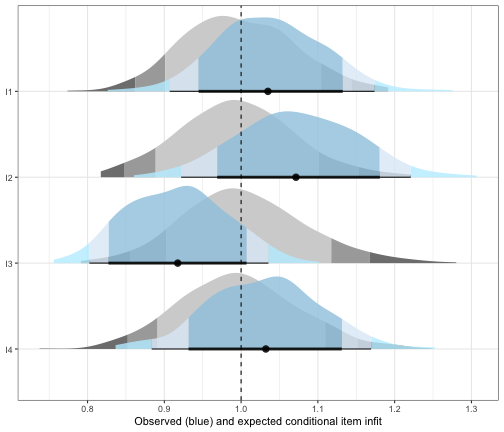
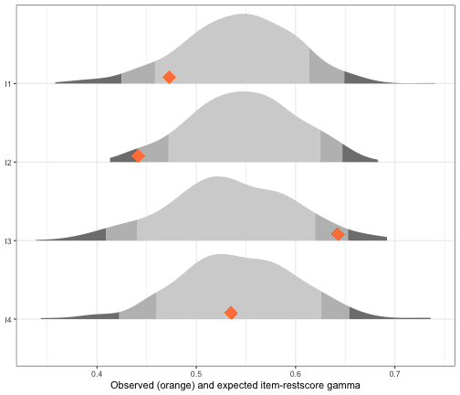
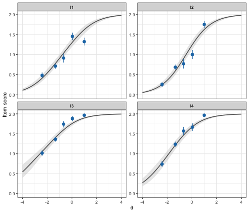
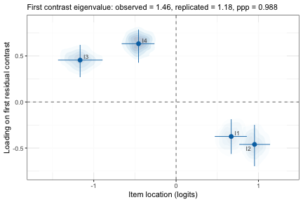
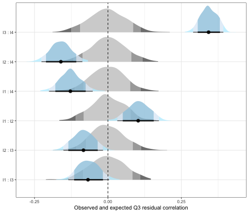
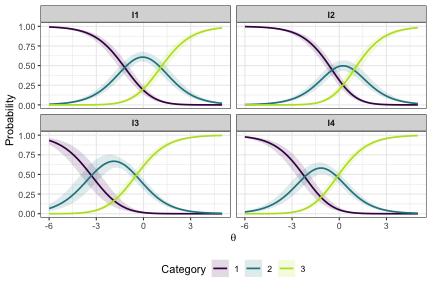
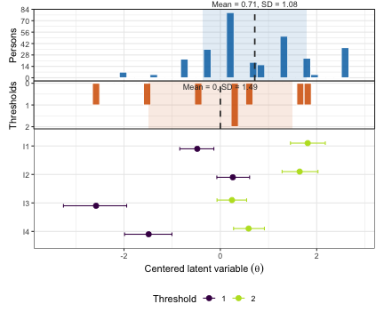
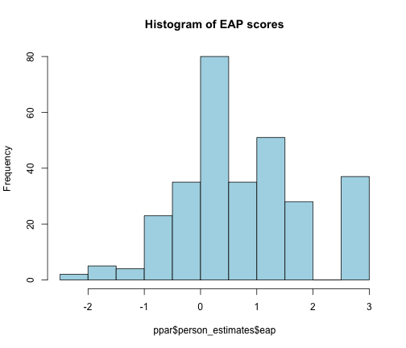

** Sorry! This is a slightly premature update of this vignette to match 
version 0.1.1 that is not yet on CRAN. The 0.1.0 vignette is available 
[via CRAN](https://cran.r-project.org/web/packages/easyRaschBayes/vignettes/pcm-rasch-analysis.html) 
and I hope to have the new version on CRAN before end of March 2026.**


## Overview

This vignette demonstrates a Partial Credit Model (PCM) Rasch analysis
workflow using `easyRaschBayes`. The analysis uses the `eRm::pcmdat2` dataset, a
small polytomous item response data set included in the `eRm` package.

All functions in this package work with a Bayesian `brms` model object fitted with the
`acat` (adjacent categories) family, which parameterises the PCM. Dichotomous 
Rasch models can also be fit using `brms` and analyzed with the functions in
this package. A code example is available 
[here](https://pgmj.github.io/reliability.html#rasch-dichotomous-model), and more 
detail is available in [Bürkner, 2021](https://doi.org/10.18637/jss.v100.i05).

Below, there is some brief texts explaining the output and interpretation of key functions.
For a more extensive treatment of various Rasch analysis aspects, please see the
[`easyRasch` vignette](https://pgmj.github.io/raschrvignette/RaschRvign.html). 
Also, each function includes documentation and example code, use `?function` in your
console.

## Data Preparation


``` r
library(easyRaschBayes)
library(brms)
library(dplyr)
library(tidyr)
library(tibble)
library(ggplot2)
```

`eRm::pcmdat2` is in wide format with item responses coded 0, 1, 2, …. The
`brms` `acat` family expects response categories starting at **1**, so we add 1
to every response before reshaping to long format.


``` r
df_pcm <- eRm::pcmdat2 %>%
  mutate(across(everything(), ~ .x + 1)) %>%
  rownames_to_column("id") %>%
  pivot_longer(!id, names_to = "item", values_to = "response")

head(df_pcm)
#> # A tibble: 6 × 3
#>   id    item  response
#>   <chr> <chr>    <dbl>
#> 1 1     I1           2
#> 2 1     I2           2
#> 3 1     I3           2
#> 4 1     I4           2
#> 5 2     I1           1
#> 6 2     I2           1
```

## Fitting the PCM

The model is fitted once and saved to disk. The code chunk below shows the
fitting call (not evaluated during `R CMD check`). A pre-fitted model stored at
`fits/fit_pcm.rds` is loaded instead.


``` r
prior_pcm <- prior("normal(0, 3)", class = "Intercept") +
  prior("normal(0, 3)", class = "sd", group = "id")
```


``` r
fit_pcm <- brm(
  response | thres(gr = item) ~ 1 + (1 | id),
  data    = df_pcm,
  family  = acat,
  prior   = prior_pcm,
  chains  = 4,
  cores   = 4,
  iter    = 2000
)
saveRDS(fit_pcm, "fits/fit_pcm.rds")
```


``` r
fit_pcm <- readRDS("fits/fit_pcm.rds")
```

## Item Fit: Infit and Outfit Statistics

`infit_statistic()` computes posterior predictive infit and outfit statistics
for each item. Values near 1.0 indicate good fit; values substantially above 1
suggest underfit (unexpected responses), values below 1 suggest overfit (too
predictable).

The `ndraws_use` argument limits the number of posterior draws used, which
speeds up computation during exploration. For final reporting, use all draws
(set `ndraws_use = NULL` or omit it).


``` r
fit_stats <- infit_statistic(fit_pcm, ndraws_use = 500)

# Post-process infit
infit_results <- infit_post(fit_stats)
infit_results$summary
#> # A tibble: 4 × 4
#>   item  infit_obs infit_rep infit_ppp
#>   <chr>     <dbl>     <dbl>     <dbl>
#> 1 I1        1.04      0.997     0.286
#> 2 I2        1.07      0.995     0.154
#> 3 I3        0.916     1.00      0.912
#> 4 I4        1.03      0.996     0.338
infit_results$plot
```

<div class="figure">

<p class="caption">plot of chunk infit</p>
</div>

`infit_obs` indicates the observed conditional infit, which can be compared to `infit_rep`, 
which is akin to the model expected value. Posterior predictive p-values (`*_ppp`) 
close to 0.5 indicate that the observed statistic falls near the centre of the 
posterior predictive distribution, implying good fit. Values near 0 or 1 warrant 
further investigation.

## Item–Rest Score Association

`item_restscore_statistic()` computes Goodman-Kruskal's gamma between each
item's observed responses and the rest score (total score minus the focal item).
In a well-fitting Rasch model, gamma should be positive and moderate; very high
values may indicate redundancy, very low or negative values suggest the item
does not relate well to the latent trait.


``` r
rest_stats <- item_restscore_statistic(fit_pcm, ndraws_use = 500)

rest_results <- item_restscore_post(rest_stats)
rest_results$summary
#> # A tibble: 4 × 5
#>   item  gamma_obs gamma_rep gamma_diff   ppp
#>   <chr>     <dbl>     <dbl>      <dbl> <dbl>
#> 1 I1        0.473     0.542     -0.069 0.108
#> 2 I2        0.441     0.548     -0.107 0.026
#> 3 I3        0.643     0.533      0.11  0.964
#> 4 I4        0.535     0.542     -0.007 0.474
rest_results$plot
```

<div class="figure">

<p class="caption">plot of chunk restscore</p>
</div>

## Conditional ICC plot


``` r
plot_icc(fit_pcm)
```

<div class="figure">

<p class="caption">plot of chunk ciccplot</p>
</div>

## Dimensionality: Residual PCA

`plot_residual_pca()` performs a principal components analysis on the
person-item residuals and plots the standardized loadings on the first residual 
contrast factor together with item locations and the uncertainty of both.


``` r
pca <- plot_residual_pca(fit_pcm, ndraws_use = 500)
pca$plot
```

<div class="figure">

<p class="caption">plot of chunk pca-plot</p>
</div>

Items with positive loadings cluster on one end, negative loadings on the other.
If the observed largest eigenvalue is smaller than the replicated, unidimensionality
is supported. The ppp should not be close to 1.

## Local Dependence: Q3 Residual Correlations

`q3_statistic()` computes Yen's Q3 statistic — the correlation between
person-item residuals for every item pair. After conditioning on the latent
trait, residuals should be uncorrelated; elevated Q3 values indicate local
dependence (LD). Our primary metric here is the ppp, that should not be close to 1.
The output is filtered on ppp values above 0.95.


``` r
q3_stats <- q3_statistic(fit_pcm, ndraws_use = 500)

q3_results <- q3_post(q3_stats)
q3_results$summary
#> # A tibble: 6 × 7
#>   item_pair item_1 item_2 q3_obs q3_rep q3_diff q3_ppp
#>   <chr>     <chr>  <chr>   <dbl>  <dbl>   <dbl>  <dbl>
#> 1 I3 : I4   I3     I4      0.343 -0.003   0.346  1    
#> 2 I1 : I2   I1     I2      0.104 -0.001   0.105  0.998
#> 3 I1 : I3   I1     I3     -0.066 -0.003  -0.063  0.044
#> 4 I2 : I3   I2     I3     -0.084 -0.001  -0.083  0.002
#> 5 I1 : I4   I1     I4     -0.128 -0.002  -0.126  0    
#> 6 I2 : I4   I2     I4     -0.16   0      -0.16   0
q3_results$plot
```

<div class="figure">

<p class="caption">plot of chunk q3</p>
</div>

## Item Category Probabilities

This plot shows the probability of using a response category on the y axis and
the latent score on the x axis. The crossover points, where lines meet, are the 
item category threshold locations. Uncertainty is shown with the shaded area around
each line.


``` r
plot_ipf(fit_pcm, theta_range = c(-6,5))
```

<div class="figure">

<p class="caption">plot of chunk ipf-plot</p>
</div>


## Person–Item Targeting

`plot_targeting()` produces a Wright map (person–item targeting plot) showing
the distribution of person locations alongside the item threshold locations on
the same logit scale. Good targeting occurs when person and item distributions
overlap substantially.


``` r
plot_targeting(fit_pcm)
```

<div class="figure">

<p class="caption">plot of chunk targeting</p>
</div>

## Reliability: Relative Measurement Uncertainty

`RMUreliability()` provides a Bayesian reliability estimate via Relative
Measurement Uncertainty (RMU, see Bignardi et al., 2025). It requires a matrix 
of person location draws with dimensions \[persons × draws\]. The output is a 
point estimate and lower/upper 95% highest density continuous intervals (HDCI).


``` r
person_draws <- fit_pcm %>%
  as_draws_df() %>%
  as_tibble() %>% 
  select(starts_with("r_id")) %>%
  t()
rmu <- RMUreliability(person_draws)
rmu
#>   rmu_estimate hdci_lowerbound hdci_upperbound .width .point .interval
#> 1    0.6715786       0.6097665       0.7285306   0.95   mean      hdci
```

RMU values range from 0 to 1, with higher values indicating higher reliability, 
similarly to traditional reliability metrics such as Cronbach's alpha.

## Item parameters


``` r
ipar <- item_parameters(fit_pcm)
knitr::kable(ipar$summary)
```


|item | threshold| location|     se| hdci_lower| hdci_upper| n_eff|
|:----|---------:|--------:|------:|----------:|----------:|-----:|
|I1   |         1|  -0.4792| 0.1819|    -0.8505|    -0.1457|  3734|
|I1   |         2|   1.8135| 0.1840|     1.4532|     2.1753|  3503|
|I2   |         1|   0.2591| 0.1751|    -0.0743|     0.6055|  3423|
|I2   |         2|   1.6465| 0.1908|     1.3032|     2.0377|  3350|
|I3   |         1|  -2.5798| 0.3347|    -3.2377|    -1.9333|  4000|
|I3   |         2|   0.2413| 0.1569|    -0.0609|     0.5475|  3255|
|I4   |         1|  -1.4880| 0.2529|    -1.9889|    -1.0082|  4000|
|I4   |         2|   0.5866| 0.1608|     0.2573|     0.8902|  4000|


``` r
knitr::kable(ipar$locations_wide)
```


|item |      t1|     t2| location|
|:----|-------:|------:|--------:|
|I3   | -2.5798| 0.2413|  -1.1693|
|I4   | -1.4880| 0.5866|  -0.4507|
|I1   | -0.4792| 1.8135|   0.6672|
|I2   |  0.2591| 1.6465|   0.9528|


## Person parameters

This estimates latent scores.


``` r
ppar <- person_parameters(fit_pcm)
knitr::kable(ppar$score_table)
```


| sum_score|  n|     eap| eap_se|     wle| wle_se|
|---------:|--:|-------:|------:|-------:|------:|
|         0|  7| -1.9948| 0.8723| -7.0000|    NaN|
|         1|  4| -1.3413| 0.7962| -3.0165| 1.3597|
|         2| 23| -0.7713| 0.7451| -1.5860| 0.9883|
|         3| 35| -0.2446| 0.7225| -0.6911| 0.8665|
|         4| 80|  0.2582| 0.7107|  0.0616| 0.8151|
|         5| 35|  0.7609| 0.7140|  0.7901| 0.8208|
|         6| 51|  1.2865| 0.7428|  1.6205| 0.9128|
|         7| 28|  1.8658| 0.8013|  2.9849| 1.3554|
|         8| 37|  2.5625| 0.8963|  7.0000|    NaN|


``` r
hist(ppar$person_estimates$eap, col = "lightblue", main = "Histogram of EAP scores")
```

<div class="figure">

<p class="caption">plot of chunk ppar</p>
</div>

## References 

Bürkner, P.-C. (2021). Bayesian Item Response Modeling in R with brms and
Stan. *Journal of Statistical Software*, *100*, 1–54.
<https://doi.org/10.18637/jss.v100.i05>
